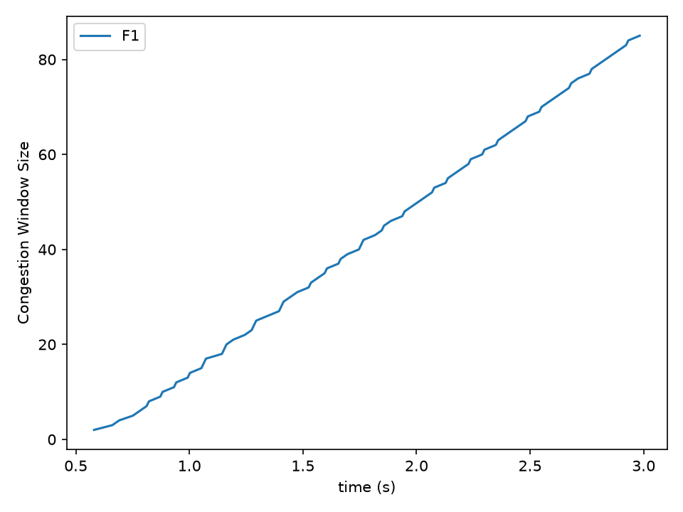
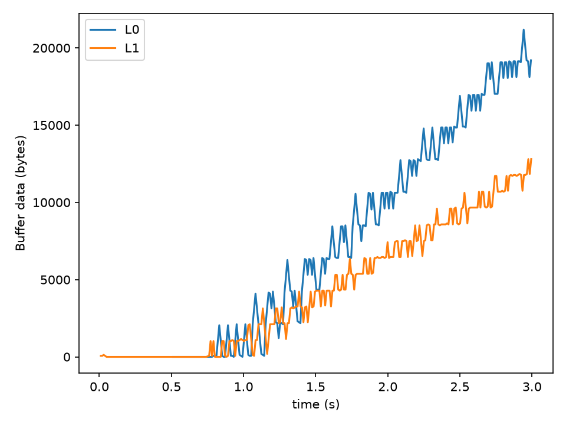
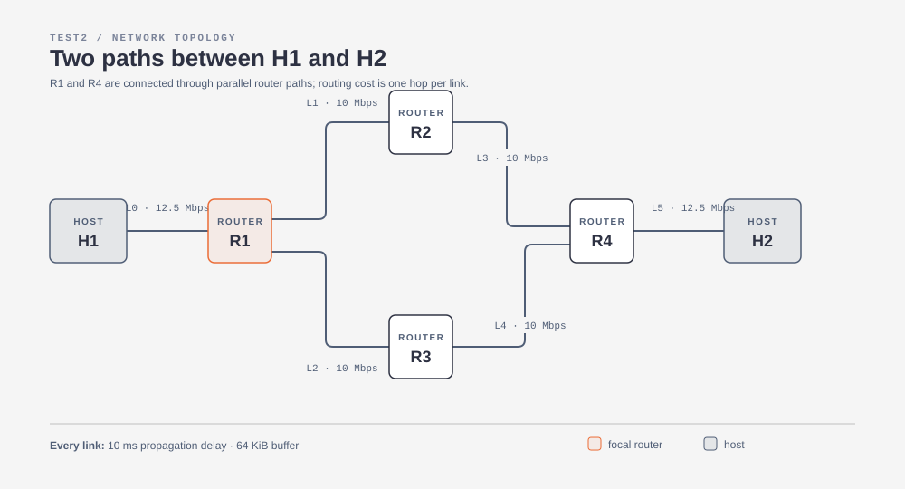

# Python Network Simulator

Python Network Simulator models packet delivery through hosts, routers, and links. The simulator includes simplified TCP Tahoe and TCP Reno, link propagation and transmission delays, finite link buffers, packet drops, and distance-vector routing between routers.

The repository contains three ready-to-run scenarios. The simulator writes event records to standard output; the plotting helper reads those records and draws congestion-window and link-buffer plots.

Run a scenario, save its event stream, and generate plots with three commands:

```bash
python netsim.py Test2 3 > test2.log
python visualize.py test2.log --flows F1 --links L0 L1 --output-prefix test2
ls test2_cwnd.png test2_buffers.png
```

The result is a congestion-window plot and a link-buffer plot like these:

<p align="center">
  
  
</p>

The first image shows TCP's congestion window growing for flow `F1`. The second image shows queued bytes on links `L0` and `L1`; rising queue occupancy indicates contention and can precede packet drops. These images were generated from the included `Test2` topology, so the repository gives you both the configuration and a concrete view of the output.

The network being simulated is the `Test2` topology below. Hosts send traffic through routers, and the two middle paths give the distance-vector routing logic a choice of route:

<p align="center">
  
</p>

## How it works

The simulation uses [SimPy](https://simpy.readthedocs.io/) to advance a virtual clock. A flow creates 1 KiB data packets, sends packets through the source host's link, and waits for acknowledgements. Each link has a transmission rate in Mbps, a propagation delay in milliseconds, and a finite buffer measured in KiB.

Routers initialize distance vectors and exchange routing updates with neighboring routers. Each router forwards packets using the lowest-cost known route. The current link cost is one hop, so routing chooses the path with the fewest links rather than the path with the highest bandwidth or lowest delay.

TCP starts with a congestion window of one packet. A flow moves between slow start (`SS`), congestion avoidance (`CA`), and fast recovery (`FR`). Tahoe returns to a window of one after three duplicate acknowledgements; Reno enters fast recovery. A timeout also returns the flow to slow start. The implementation is educational and is not a complete TCP implementation.

## Installation

Python 3.9 or newer is recommended.

```bash
git clone <repository-url>
cd PythonNetworkSimulator
python3 -m venv .venv
source .venv/bin/activate       # Windows PowerShell: .venv\\Scripts\\Activate.ps1
python -m pip install -r requirements.txt
```

## Run a scenario

The command-line interface takes a scenario directory and a simulation duration in virtual seconds:

```bash
python netsim.py Test1 30
```

To save the event stream for plotting, redirect standard output to a log file:

```bash
python netsim.py Test2 100 > test2_reno.log
```

The command does not wait for real time to pass. `100` means that SimPy processes events until simulation time reaches 100 seconds.

## Output

The output is comma-separated and can be inspected with ordinary command-line tools or imported into another analysis program. Typical records look like this:

```text
BUF,0.532000,L0,0,0,H1->R1
BUF,0.544000,L1,1024,1,H1->H2
FLOW,0.576000,F1,2,20969472,0.080000,2048000.000000,SS
TRIPACK,1.248000,F1,7
TIME,2.014000,F1,12
DROP,2.015000,L1,H1->H2
```

| Record | Fields after the record name | Meaning |
| --- | --- | --- |
| `BUF` | time, link, bytes, queued packets, source->destination | Link state after a packet leaves the link |
| `FLOW` | time, flow, congestion window, bytes remaining, estimated RTT, rate, TCP state | Flow measurement |
| `TRIPACK` | time, flow, acknowledgement number | Three duplicate acknowledgements triggered recovery |
| `TIME` | time, flow, sequence number | A retransmission timeout occurred |
| `DROP` | time, link, source->destination | A packet was rejected because the link buffer was full |

Exact timestamps and event counts depend on the scenario and on the random initial acknowledgement sequence number.

## Plot congestion windows and buffers

The plotting script reads a saved log and produces two figures: congestion-window size over time and buffered bytes over time.

```bash
python visualize.py test2_reno.log
```

To save the figures as PNG files instead of opening interactive windows:

```bash
python visualize.py test2_reno.log --output-prefix test2_reno
```

The command creates `test2_reno_cwnd.png` and `test2_reno_buffers.png`. The first plot shows TCP growth and reduction after loss. The second plot shows queue occupancy in bytes; spikes indicate contention before transmission or drops. Select particular flows or links when a scenario contains many of them:

```bash
python visualize.py test3.log --flows F1 F2 F3 --links L1 L2 L3 --output-prefix test3
```

## Included scenarios

| Directory | Topology and purpose | Example |
| --- | --- | --- |
| `Test1` | One 10 Mbps host-to-host link; one Tahoe flow | `python netsim.py Test1 30` |
| `Test2` | Two parallel router paths; one Reno flow | `python netsim.py Test2 100` |
| `Test3` | Four routers and three staggered Tahoe flows | `python netsim.py Test3 100` |

Each scenario contains `netfile.csv` and `flowfile.csv`.

### Network file format

Each non-comment line in `netfile.csv` has this format:

```text
link_name,node1,node2,rate_mbps,propagation_delay_ms,buffer_kib
```

Node names beginning with `R` become routers. All other node names become hosts. Lines beginning with `#` and blank lines are ignored.

### Flow file format

Each non-comment line in `flowfile.csv` has this format:

```text
flow_name,source,destination,data_kib,start_seconds,tcp_type
```

`tcp_type` must be `tahoe` or `reno`, case-insensitive. A flow's source and destination must exist in the network file.

## Project files

- `netsim.py` loads CSV configuration, creates the SimPy environment, and runs the command-line simulation.
- `node.py` implements hosts, routers, packet forwarding, and distance-vector routing.
- `link.py` implements transmission, propagation delay, buffering, and packet drops.
- `flow.py` implements data transfer, acknowledgements, retransmissions, and simplified TCP Tahoe/Reno state changes.
- `visualize.py` parses `FLOW` and `BUF` records and creates the two plots.
- `Test1/`, `Test2/`, and `Test3/` contain example network and flow configurations.

## Limitations

The simulator is designed for experimentation and teaching. It assumes that each host uses its first attached link for flow traffic, uses a fixed packet size of 1 KiB, assigns every link a routing cost of one, and does not provide a separate results file or packet-level capture format. Validate topology or protocol changes by inspecting both the event log and generated plots.
